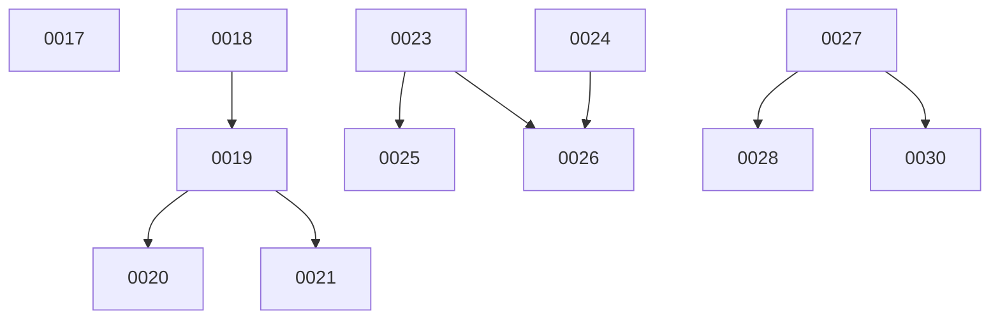

# Backlog

**31 changes** — 🟡 15 proposed · ✅ 13 done · 🗑️ 3 killed

## 🟡 Proposed (15)

### Group A — MCP evolution (changes 18–22)

| # | Title | Priority | Type | Dependencies |
|---|-------|----------|------|-------------|
| [0018](active/0018-mcp-streamable-http.md) | Streamable HTTP transport for MCP (v2025-03-26) | `high` | `feat` | 7 |
| [0019](active/0019-mcp-capability-negotiation.md) | MCP capability negotiation — structured init handshake | `high` | `feat` | 3, 7 |
| [0020](active/0020-mcp-progress-streaming.md) | MCP `$/progress` notifications and streaming tool results | `medium` | `feat` | 19 |
| [0021](active/0021-mcp-resource-subscriptions.md) | MCP resource subscriptions — push-based updates | `medium` | `feat` | 19 |
| [0022](active/0022-mcp-websocket-transport.md) | WebSocket transport for MCP | `low` | `feat` | 7 |
| [0031](active/0031-fuse-mcp-error-codes.md) | Adopt MCP-specific JSON-RPC error code range | `low` | `chore` | 3 |

### Group B — Multi-agent orchestration (changes 23–26)

| # | Title | Priority | Type | Dependencies |
|---|-------|----------|------|-------------|
| [0023](active/0023-agent-blackboard.md) | Shared result blackboard for inter-agent communication | `high` | `feat` | 12 |
| [0024](active/0024-structured-delegation.md) | Structured delegation — expected result schemas for spawn_agent | `medium` | `feat` | 12 |
| [0025](active/0025-agent-to-agent-messaging.md) | Agent-to-agent messaging — note passing for debate/refine patterns | `medium` | `feat` | 12, 23 |
| [0026](active/0026-agent-workflow-composition.md) | Workflow composition — chain, fan-out, and conditional routing | `medium` | `feat` | 12, 23, 24 |

### Group C — Context management (changes 27–30)

| # | Title | Priority | Type | Dependencies |
|---|-------|----------|------|-------------|
| [0027](active/0027-context-summarization.md) | Anchored context summarization at compression threshold | `high` | `feat` | 12 |
| [0028](active/0028-semantic-tool-relevance.md) | Semantic tool-result relevance scoring for smarter pruning | `medium` | `feat` | 27 |
| [0029](active/0029-read-file-dedup-cache.md) | Read_file content deduplication cache | `medium` | `feat` | 12 |
| [0030](active/0030-segment-store.md) | Segment store — pre-compaction transcript archive for replay | `low` | `feat` | 27 |

### Existing

| # | Title | Priority | Type | Readiness |
|---|-------|----------|------|-----------|
| [0017](active/0017-auto-mode.md) | Auto mode — layered safe/unsafe classification for autonomous tool approval | `medium` | `feat` | build-ready |

✅🗑️ Archive — done + killed (16)

| # | Title | Merged |
|---|-------|--------|
| [0016](archive/2026-08-05-0016-one-shot-cli-approvals.md) | Remove the AlwaysApprove one-shot bypass; surface approvals at the CLI | 2026-08-05 |
| [0015](archive/2026-08-05-0015-tui-hanging-indent-wrap.md) | Hanging-indent wrapping for the shell transcript | 2026-08-05 |
| [0014](archive/2026-08-05-0014-research-mode.md) | Research Mode — Web Search, Fetch & Cited Synthesis on the Subagent Runtime | 2026-08-05 |
| [0013](archive/2026-08-05-0013-startup-banner.md) | ASCII art startup banner — shell init & fuse help | 2026-08-05 |
| [0012](archive/2026-08-05-0012-subagent-ux.md) | First-Class Subagent UX — Spawn, Tree Visualization & Inspect | 2026-08-05 |
| [0011](archive/2026-08-05-0011-deep-research.md) | Deep Research Mode — Web Search + Fan-out Synthesis | 2026-08-05 |
| [0010](archive/2026-08-04-0010-shell-slash-command-ui.md) | Shell Slash-Command Autocomplete + MCP & Skill Invocation | 2026-08-04 |
| [0009](archive/2026-08-04-0009-mcp-management-cli.md) | `fuse mcps` MCP Server Management CLI + `/mcps` Shell Built-in | 2026-08-04 |
| [0008](archive/2026-08-04-0008-mcp-integration-test-harness.md) | MCP Integration Test Harness (Docker Compose + Playwright) | 2026-08-04 |
| [0007](archive/2026-08-04-0007-mcp-http-oauth.md) | Remote MCP Servers via HTTP/SSE Transport + OAuth 2.0 | 2026-08-04 |
| [0006](archive/2026-08-04-0006-tui-markdown-rendering.md) | Terminal Markdown Rendering | 2026-08-04 |
| [0005](archive/2026-08-04-0005-tui-gutter-indent-fix.md) | Fix file-read gutter indentation in TUI | 2026-08-04 |
| [0004](archive/2026-08-04-0004-skill-runtime.md) | Skill Runtime | 2026-08-04 |
| [0003](archive/2026-08-04-0003-hitl-permissions-mcp.md) | HITL Permission Layer + MCP Client Integration | 2026-08-04 |
| [0002](archive/2026-08-04-0002-tui-mvp-makefile.md) | Bubbletea TUI MVP + Makefile | 2026-08-04 |
| [0001](archive/2026-08-04-0001-fuse.md) | Fuse — Multi-Model Agent Harness | 2026-08-04 |

