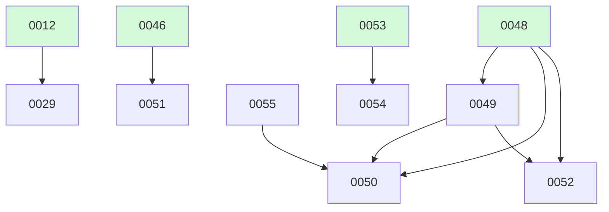

# Backlog

**55 changes** — 🟢 1 in progress · 🟡 5 proposed · ⚪ 1 deferred · ✅ 42 done · 🗑️ 6 killed

## 🟢 In progress (1)

| # | Title | Priority | Type | Spec | Branch |
|---|-------|----------|------|------|--------|
| [0055](active/0055-grpc-protobuf-transport-idl-defined-loop-wire-successor-to-4.md) | Connect/protobuf transport — IDL-defined loop.* wire, successor to #48 | `medium` | `feat` | [spec](../superpowers/specs/2026-08-11-grpc-connect-transport-design.md) | `feat/grpc-protobuf-transport-idl-defined-loop-wire-successor-to-4` |

## 🟡 Proposed (5)

| # | Title | Priority | Type | Readiness |
|---|-------|----------|------|-----------|
| [0049](active/0049-auth-multi-tenancy.md) | Auth / multi-tenancy — loop_id ownership and per-tenant isolation for the deployed service | `medium` | `feat` | needs-brainstorm |
| [0050](active/0050-client-sdk.md) | Client SDK — Runtime-parity Go + TS/JS libraries, same API local-or-remote | `medium` | `feat` | ⏳ waiting on #49 — not yet built |
| [0051](active/0051-loop-observability-otel-metrics.md) | Observability for the loop — OTEL traces + Prometheus metrics + Grafana + Loki, as a projection over the event stream | `medium` | `feat` | needs-brainstorm |
| [0052](active/0052-tool-identity-propagation.md) | Tool/resource identity propagation — per-call RFC 8693 token exchange to downstream MCP/APIs | `medium` | `feat` | ⏳ waiting on #49 — not yet built |
| [0054](active/0054-durable-resumable-sessions.md) | Durable, resumable sessions — a conversation survives disconnect; refresh restores transcript + memory | `medium` | `feat` | needs-brainstorm |

## ⚪ Deferred (1)

| # | Title | Priority | Type |
|---|-------|----------|------|
| [0029](active/0029-read-file-dedup-cache.md) | Read_file content deduplication cache | `medium` | `feat` |

✅🗑️ Archive — done + killed (48)

| # | Title | Merged |
|---|-------|--------|
| [0053](archive/2026-08-11-0053-persistent-conversational-loop.md) | Persistent conversational loop — interactive mode so one loop_id carries a multi-turn chat | 2026-08-11 |
| [0048](archive/2026-08-11-0048-networked-runtime-binding.md) | Networked binding over the Runtime seam — WS live observe + HTTP start/send/replay | 2026-08-11 |
| [0047](archive/2026-08-11-0047-durable-distributed-event-store.md) | Durable / distributed event store — survives restart and is shared across instances | 2026-08-11 |
| [0046](archive/2026-08-10-0046-multi-loop-host-deglobalize-event-store.md) | De-globalize the event store + multi-loop host — one process hosts N loops keyed by loop_id | 2026-08-10 |
| [0045](archive/2026-08-10-0045-runtime-interface-and-binding.md) | Runtime interface + second binding — prove the platform boundary is emergent | 2026-08-10 |
| [0044](archive/2026-08-10-0044-spawn-handle-async.md) | Spawn handle-async — location-transparent spawning behind a handle-returning contract | 2026-08-10 |
| [0043](archive/2026-08-10-0043-runtime-eventstore-seam.md) | Runtime EventStore seam — typed, pluggable, introspectable loop event stream | 2026-08-10 |
| [0042](archive/2026-08-10-0042-return-result-structured-delegation.md) | Fix structured-delegation (expects) vs tool-calling collision via a return_result tool | 2026-08-10 |
| [0041](archive/2026-08-09-0041-agents-panel-ux.md) | Agents split-panel UX — focus indicator, reliable scrolling, blackboard readability | 2026-08-09 |
| [0040](archive/2026-08-09-0040-auto-mode-flow-parity.md) | Auto-mode flow parity — in-workspace edits auto-approve | 2026-08-09 |
| [0030](archive/2026-08-09-0030-segment-store.md) | Segment store — pre-compaction transcript archive for replay | 2026-08-09 |
| [0028](archive/2026-08-08-0028-semantic-tool-relevance.md) | Semantic tool-result relevance scoring for smarter pruning | 2026-08-08 |
| [0027](archive/2026-08-08-0027-context-summarization.md) | Anchored context summarization at compression threshold | 2026-08-08 |
| [0026](archive/2026-08-08-0026-agent-workflow-composition.md) | Workflow composition — chain, fan-out, and conditional routing | 2026-08-08 |
| [0025](archive/2026-08-08-0025-agent-to-agent-messaging.md) | Agent-to-agent messaging — note passing for debate/refine patterns | 2026-08-08 |
| [0024](archive/2026-08-08-0024-structured-delegation.md) | Structured delegation — expected result schemas for spawn_agent | 2026-08-08 |
| [0022](archive/2026-08-08-0022-mcp-websocket-transport.md) | WebSocket transport for MCP | 2026-08-08 |
| [0032](archive/2026-08-05-0032-shell-mode-switcher.md) | Shell permission-mode switcher — cycle smart/auto in the TUI, with a visible mode indicator | 2026-08-05 |
| [0016](archive/2026-08-05-0016-one-shot-cli-approvals.md) | Remove the AlwaysApprove one-shot bypass; surface approvals at the CLI | 2026-08-05 |
| [0011](archive/2026-08-05-0011-deep-research.md) | Deep Research Mode — Web Search + Fan-out Synthesis | 2026-08-05 |
| [0009](archive/2026-08-04-0009-mcp-management-cli.md) | `fuse mcps` MCP Server Management CLI + `/mcps` Shell Built-in | 2026-08-04 |

**Older done (collapsed)**

| Month | Done |
|-------|------|
| [2026-08](archive/) | 27 done |

