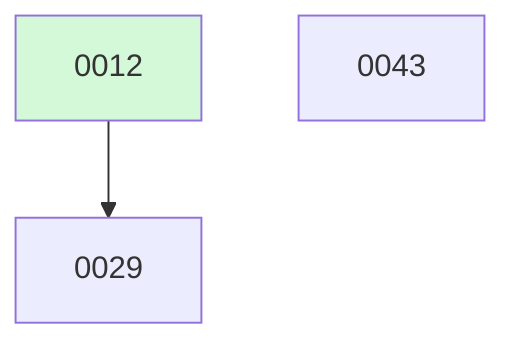

# Backlog

**43 changes** — 🟡 1 proposed · ⚪ 1 deferred · ✅ 35 done · 🗑️ 6 killed

## 🟡 Proposed (1)

| # | Title | Priority | Type | Readiness |
|---|-------|----------|------|-----------|
| [0043](active/0043-runtime-eventstore-seam.md) | Runtime EventStore seam — typed, pluggable, introspectable loop event stream | `high` | `feat` | build-ready |

## ⚪ Deferred (1)

| # | Title | Priority | Type |
|---|-------|----------|------|
| [0029](active/0029-read-file-dedup-cache.md) | Read_file content deduplication cache | `medium` | `feat` |

✅🗑️ Archive — done + killed (41)

| # | Title | Merged |
|---|-------|--------|
| [0042](archive/2026-08-10-0042-return-result-structured-delegation.md) | Fix structured-delegation (expects) vs tool-calling collision via a return_result tool | 2026-08-10 |
| [0041](archive/2026-08-09-0041-agents-panel-ux.md) | Agents split-panel UX — focus indicator, reliable scrolling, blackboard readability | 2026-08-09 |
| [0040](archive/2026-08-09-0040-auto-mode-flow-parity.md) | Auto-mode flow parity — in-workspace edits auto-approve | 2026-08-09 |
| [0030](archive/2026-08-09-0030-segment-store.md) | Segment store — pre-compaction transcript archive for replay | 2026-08-09 |
| [0028](archive/2026-08-08-0028-semantic-tool-relevance.md) | Semantic tool-result relevance scoring for smarter pruning | 2026-08-08 |
| [0027](archive/2026-08-08-0027-context-summarization.md) | Anchored context summarization at compression threshold | 2026-08-08 |
| [0026](archive/2026-08-08-0026-agent-workflow-composition.md) | Workflow composition — chain, fan-out, and conditional routing | 2026-08-08 |
| [0025](archive/2026-08-08-0025-agent-to-agent-messaging.md) | Agent-to-agent messaging — note passing for debate/refine patterns | 2026-08-08 |
| [0024](archive/2026-08-08-0024-structured-delegation.md) | Structured delegation — expected result schemas for spawn_agent | 2026-08-08 |
| [0023](archive/2026-08-08-0023-agent-blackboard.md) | Shared result blackboard for inter-agent communication | 2026-08-08 |
| [0022](archive/2026-08-08-0022-mcp-websocket-transport.md) | WebSocket transport for MCP | 2026-08-08 |
| [0021](archive/2026-08-08-0021-mcp-resource-subscriptions.md) | MCP resource subscriptions — push-based updates | 2026-08-08 |
| [0020](archive/2026-08-08-0020-mcp-progress-streaming.md) | MCP `$/progress` notifications and streaming tool results | 2026-08-08 |
| [0018](archive/2026-08-08-0018-mcp-streamable-http.md) | Streamable HTTP transport for MCP (v2025-03-26) | 2026-08-08 |
| [0036](archive/2026-08-07-0036-agent-scheduler.md) | Agent scheduler — global queue, cross-pool fairness, and turn-level throughput limits | 2026-08-07 |
| [0031](archive/2026-08-07-0031-fuse-mcp-error-codes.md) | Adopt MCP-specific JSON-RPC error code range | 2026-08-07 |
| [0019](archive/2026-08-07-0019-mcp-capability-negotiation.md) | MCP capability negotiation — structured init handshake | 2026-08-07 |
| [0032](archive/2026-08-05-0032-shell-mode-switcher.md) | Shell permission-mode switcher — cycle smart/auto in the TUI, with a visible mode indicator | 2026-08-05 |
| [0016](archive/2026-08-05-0016-one-shot-cli-approvals.md) | Remove the AlwaysApprove one-shot bypass; surface approvals at the CLI | 2026-08-05 |
| [0011](archive/2026-08-05-0011-deep-research.md) | Deep Research Mode — Web Search + Fan-out Synthesis | 2026-08-05 |
| [0009](archive/2026-08-04-0009-mcp-management-cli.md) | `fuse mcps` MCP Server Management CLI + `/mcps` Shell Built-in | 2026-08-04 |

**Older done (collapsed)**

| Month | Done |
|-------|------|
| [2026-08](archive/) | 20 done |

