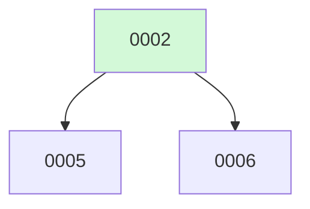

# Backlog

**7 changes** — 🟡 2 proposed · ✅ 3 done

## 🟡 Proposed (2)

| # | Title | Priority | Type | Readiness |
|---|-------|----------|------|-----------|
| [0005](active/0005-tui-gutter-indent-fix.md) | Fix file-read gutter indentation in TUI | `medium` | `fix` | build-ready |
| [0006](active/0006-tui-markdown-rendering.md) | Terminal Markdown Rendering | `medium` | `feat` | build-ready |

✅ Archive — done (3)

| # | Title | Merged |
|---|-------|--------|
| [0003](archive/2026-08-04-0003-hitl-permissions-mcp.md) | HITL Permission Layer + MCP Client Integration | 2026-08-04 |
| [0002](archive/2026-08-04-0002-tui-mvp-makefile.md) | Bubbletea TUI MVP + Makefile | 2026-08-04 |
| [0001](archive/2026-08-04-0001-fuse.md) | Fuse — Multi-Model Agent Harness | 2026-08-04 |

