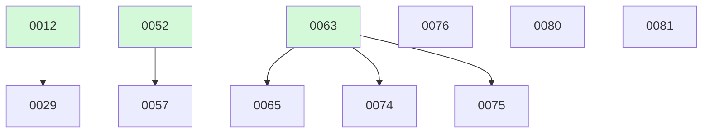

# Backlog

**81 changes** — 🟢 1 in progress · 🟡 5 proposed · ⚪ 2 deferred · ✅ 67 done · 🗑️ 6 killed

## 🟢 In progress (1)

| # | Title | Priority | Type | Spec | Branch |
|---|-------|----------|------|------|--------|
| [0080](active/0080-tui-table-tabbed-ui.md) | Shared TUI table component + tabbed /config UI — line up the menus like Claude | `medium` | `feat` | [spec](../superpowers/specs/2026-09-01-tui-table-tabbed-ui-design.md) | `feat/tui-table-tabbed-ui` |

## 🟡 Proposed (5)

| # | Title | Priority | Type | Readiness |
|---|-------|----------|------|-----------|
| [0065](active/0065-bash-per-tenant-filesystem-isolation.md) | bash per-tenant filesystem isolation — a Principal.Tenant-scoped bind-mount the working_dir cannot escape | `medium` | `feat` | needs-brainstorm |
| [0074](active/0074-sandbox-health-emitter.md) | sandbox health emitter — feed KindSandboxHealth so fuse_sandbox_unhealthy_total stops being defined-but-unfed | `medium` | `feat` | needs-brainstorm |
| [0075](active/0075-paas-remote-sandbox-substrate-adr.md) | PaaS/remote sandbox substrate — the provision/attach/teardown seam ADR, with a k8s Pod-per-Exec handler as first implementation | `medium` | `feat` | needs-brainstorm |
| [0076](active/0076-fuse-server-helm-chart-compose-stack.md) | fuse server deployment — a container image, a full docker-compose stack, and a Helm chart (not an operator) | `medium` | `feat` | needs-brainstorm |
| [0081](active/0081-shell-transcript-command-breaks.md) | Echo executed slash commands + rule breaks between transcript blocks | `medium` | `feat` | build-ready |

## ⚪ Deferred (2)

| # | Title | Priority | Type |
|---|-------|----------|------|
| [0029](active/0029-read-file-dedup-cache.md) | Read_file content deduplication cache | `medium` | `feat` |
| [0057](active/0057-egress-identity-builtin-http-tools.md) | Egress identity for built-in HTTP tools — route web_fetch/web_search through the #52 credential seam | `medium` | `feat` |

✅🗑️ Archive — done + killed (73)

| # | Title | Merged |
|---|-------|--------|
| [0079](archive/2026-09-01-0079-tui-models-management-ui.md) | TUI models management UI — argument autocomplete + interactive mapping editor | 2026-09-01 |
| [0064](archive/2026-09-01-0064-bash-egress-control-container-network-config.md) | bash egress control — egress as the container's network configuration, not an in-process dialer allowlist | 2026-09-01 |
| [0078](archive/2026-08-21-0078-slash-command-models-listing.md) | /models slash command + slash-menu column alignment | 2026-08-21 |
| [0077](archive/2026-08-21-0077-sandbox-resource-limits-concurrency-ceiling.md) | sandbox resource limits — cgroup caps per container and a concurrency ceiling on in-flight Execs | 2026-08-21 |
| [0063](archive/2026-08-21-0063-bash-container-substrate-env-scrub-off-switch.md) | bash container substrate + env-scrub + off-switch — the sandbox container behind a pluggable OCI runtime seam | 2026-08-21 |
| [0073](archive/2026-08-20-0073-one-shot-default-model.md) | One-shot honors models.default when --model is unset | 2026-08-20 |
| [0072](archive/2026-08-20-0072-docker-subcommand-classification.md) | Docker subcommand classification — read-only forms auto-approve; the rest reach the classifier instead of dying at the parse floor | 2026-08-20 |
| [0070](archive/2026-08-20-0070-auto-mode-shell-parse-widening.md) | Auto-mode shell-parse widening — env-prefixes, wrappers, control flow, redirects, opaque args | 2026-08-20 |
| [0069](archive/2026-08-19-0069-auto-mode-classifier-retune-webfetch.md) | Auto-mode classifier retune + web_fetch loosening — allow-bias for routine dev ops, seed becomes real auto-approve | 2026-08-19 |
| [0071](archive/2026-08-18-0071-turn-scoped-trace-roots-interactive-loops.md) | Turn-scoped trace roots for interactive loops — end loop.run at first park, per-turn root spans | 2026-08-18 |
| [0068](archive/2026-08-17-0068-auto-mode-deterministic-freedom.md) | Auto-mode deterministic freedom — scratchpad + write_roots + rules-layer shrink to catastrophic-only | 2026-08-17 |
| [0067](archive/2026-08-17-0067-auto-mode-permission-observability-deny-resilience.md) | Auto-mode permission observability + deny-resilience — measure every gate decision, stop dying on denials | 2026-08-17 |
| [0062](archive/2026-08-17-0062-wander-refresh-to-restore-light-up-54-durable-resume-in-the.md) | Wander refresh-to-restore — light up #54 durable resume in the browser demo | 2026-08-17 |
| [0066](archive/2026-08-16-0066-agents-tab-multiturn-turn-groups.md) | Agents tab & blackboard — turn-aware multiturn UI (collapsible turn groups + per-turn timing) | 2026-08-16 |
| [0060](archive/2026-08-16-0060-wander-live-rentals-mcp-demo-light-up-59-s-live-data-backend.md) | Wander live rentals MCP demo — light up #59's live data backend + wire the rentals server into the concierge app | 2026-08-16 |
| [0025](archive/2026-08-08-0025-agent-to-agent-messaging.md) | Agent-to-agent messaging — note passing for debate/refine patterns | 2026-08-08 |
| [0022](archive/2026-08-08-0022-mcp-websocket-transport.md) | WebSocket transport for MCP | 2026-08-08 |
| [0032](archive/2026-08-05-0032-shell-mode-switcher.md) | Shell permission-mode switcher — cycle smart/auto in the TUI, with a visible mode indicator | 2026-08-05 |
| [0016](archive/2026-08-05-0016-one-shot-cli-approvals.md) | Remove the AlwaysApprove one-shot bypass; surface approvals at the CLI | 2026-08-05 |
| [0011](archive/2026-08-05-0011-deep-research.md) | Deep Research Mode — Web Search + Fan-out Synthesis | 2026-08-05 |
| [0009](archive/2026-08-04-0009-mcp-management-cli.md) | `fuse mcps` MCP Server Management CLI + `/mcps` Shell Built-in | 2026-08-04 |

**Older done (collapsed)**

| Month | Done |
|-------|------|
| [2026-08](archive/) | 52 done |

