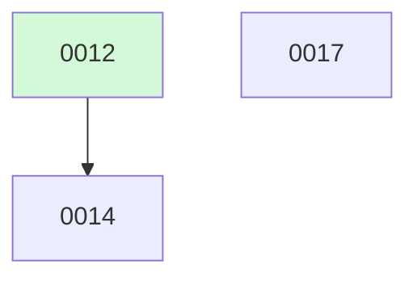

# Backlog

**17 changes** — 🟡 1 proposed · 🔵 1 implemented · ✅ 12 done · 🗑️ 3 killed

## 🟡 Proposed (1)

| # | Title | Priority | Type | Readiness |
|---|-------|----------|------|-----------|
| [0017](active/0017-auto-mode.md) | Auto mode — layered safe/unsafe classification for autonomous tool approval | `medium` | `feat` | build-ready |

## 🔵 Implemented — awaiting merge (1)

| # | Title | Priority | Type | PR | Readiness |
|---|-------|----------|------|----|-----------|
| [0014](active/0014-research-mode.md) | Research Mode — Web Search, Fetch & Cited Synthesis on the Subagent Runtime | `high` | `feat` | [#13](https://github.com/ethanhinson/fuse/pull/13) |  |

✅🗑️ Archive — done + killed (15)

| # | Title | Merged |
|---|-------|--------|
| [0016](archive/2026-08-05-0016-one-shot-cli-approvals.md) | Remove the AlwaysApprove one-shot bypass; surface approvals at the CLI | 2026-08-05 |
| [0015](archive/2026-08-05-0015-tui-hanging-indent-wrap.md) | Hanging-indent wrapping for the shell transcript | 2026-08-05 |
| [0013](archive/2026-08-05-0013-startup-banner.md) | ASCII art startup banner — shell init & fuse help | 2026-08-05 |
| [0012](archive/2026-08-05-0012-subagent-ux.md) | First-Class Subagent UX — Spawn, Tree Visualization & Inspect | 2026-08-05 |
| [0011](archive/2026-08-05-0011-deep-research.md) | Deep Research Mode — Web Search + Fan-out Synthesis | 2026-08-05 |
| [0010](archive/2026-08-04-0010-shell-slash-command-ui.md) | Shell Slash-Command Autocomplete + MCP & Skill Invocation | 2026-08-04 |
| [0009](archive/2026-08-04-0009-mcp-management-cli.md) | `fuse mcps` MCP Server Management CLI + `/mcps` Shell Built-in | 2026-08-04 |
| [0008](archive/2026-08-04-0008-mcp-integration-test-harness.md) | MCP Integration Test Harness (Docker Compose + Playwright) | 2026-08-04 |
| [0007](archive/2026-08-04-0007-mcp-http-oauth.md) | Remote MCP Servers via HTTP/SSE Transport + OAuth 2.0 | 2026-08-04 |
| [0006](archive/2026-08-04-0006-tui-markdown-rendering.md) | Terminal Markdown Rendering | 2026-08-04 |
| [0005](archive/2026-08-04-0005-tui-gutter-indent-fix.md) | Fix file-read gutter indentation in TUI | 2026-08-04 |
| [0004](archive/2026-08-04-0004-skill-runtime.md) | Skill Runtime | 2026-08-04 |
| [0003](archive/2026-08-04-0003-hitl-permissions-mcp.md) | HITL Permission Layer + MCP Client Integration | 2026-08-04 |
| [0002](archive/2026-08-04-0002-tui-mvp-makefile.md) | Bubbletea TUI MVP + Makefile | 2026-08-04 |
| [0001](archive/2026-08-04-0001-fuse.md) | Fuse — Multi-Model Agent Harness | 2026-08-04 |

