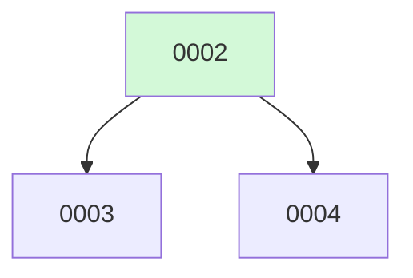

# Backlog

**4 changes** — 🟡 2 proposed · ✅ 2 done

## 🟡 Proposed (2)

| # | Title | Priority | Type | Readiness |
|---|-------|----------|------|-----------|
| [0003](active/0003-hitl-permissions-mcp.md) | HITL Permission Layer + MCP Client Integration | `high` | `feat` | build-ready |
| [0004](active/0004-skill-runtime.md) | Skill Runtime | `high` | `feat` | build-ready |

✅ Archive — done (2)

| # | Title | Merged |
|---|-------|--------|
| [0002](archive/2026-08-04-0002-tui-mvp-makefile.md) | Bubbletea TUI MVP + Makefile | 2026-08-04 |
| [0001](archive/2026-08-04-0001-fuse.md) | Fuse — Multi-Model Agent Harness | 2026-08-04 |

