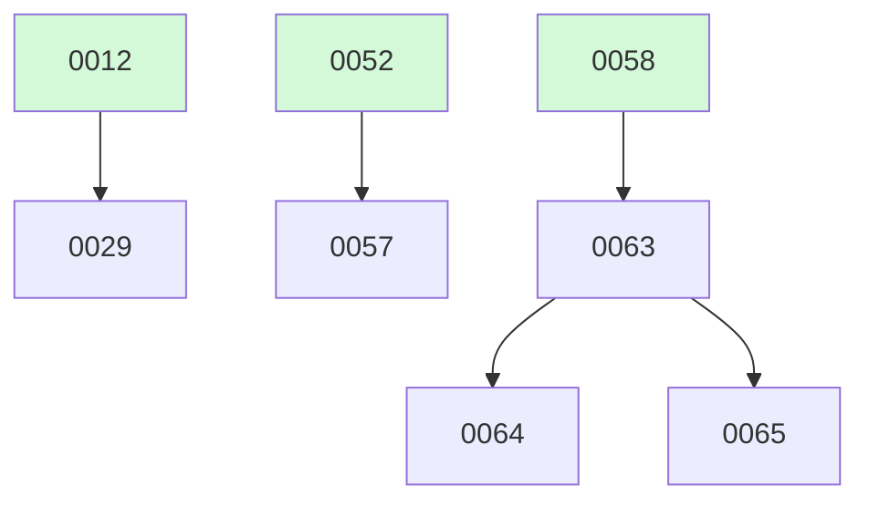

# Backlog

**73 changes** — 🟡 3 proposed · ⚪ 2 deferred · ✅ 62 done · 🗑️ 6 killed

## 🟡 Proposed (3)

| # | Title | Priority | Type | Readiness |
|---|-------|----------|------|-----------|
| [0063](active/0063-bash-container-substrate-env-scrub-off-switch.md) | bash container substrate + env-scrub + off-switch — the sandbox container behind a pluggable OCI runtime seam | `high` | `feat` | build-ready |
| [0064](active/0064-bash-egress-control-container-network-config.md) | bash egress control — egress as the container's network configuration, not an in-process dialer allowlist | `medium` | `feat` | ⏳ waiting on #63 — not yet built |
| [0065](active/0065-bash-per-tenant-filesystem-isolation.md) | bash per-tenant filesystem isolation — a Principal.Tenant-scoped bind-mount the working_dir cannot escape | `medium` | `feat` | ⏳ waiting on #63 — not yet built |

## ⚪ Deferred (2)

| # | Title | Priority | Type |
|---|-------|----------|------|
| [0029](active/0029-read-file-dedup-cache.md) | Read_file content deduplication cache | `medium` | `feat` |
| [0057](active/0057-egress-identity-builtin-http-tools.md) | Egress identity for built-in HTTP tools — route web_fetch/web_search through the #52 credential seam | `medium` | `feat` |

✅🗑️ Archive — done + killed (68)

| # | Title | Merged |
|---|-------|--------|
| [0073](archive/2026-08-20-0073-one-shot-default-model.md) | One-shot honors models.default when --model is unset | 2026-08-20 |
| [0072](archive/2026-08-20-0072-docker-subcommand-classification.md) | Docker subcommand classification — read-only forms auto-approve; the rest reach the classifier instead of dying at the parse floor | 2026-08-20 |
| [0070](archive/2026-08-20-0070-auto-mode-shell-parse-widening.md) | Auto-mode shell-parse widening — env-prefixes, wrappers, control flow, redirects, opaque args | 2026-08-20 |
| [0069](archive/2026-08-19-0069-auto-mode-classifier-retune-webfetch.md) | Auto-mode classifier retune + web_fetch loosening — allow-bias for routine dev ops, seed becomes real auto-approve | 2026-08-19 |
| [0071](archive/2026-08-18-0071-turn-scoped-trace-roots-interactive-loops.md) | Turn-scoped trace roots for interactive loops — end loop.run at first park, per-turn root spans | 2026-08-18 |
| [0068](archive/2026-08-17-0068-auto-mode-deterministic-freedom.md) | Auto-mode deterministic freedom — scratchpad + write_roots + rules-layer shrink to catastrophic-only | 2026-08-17 |
| [0067](archive/2026-08-17-0067-auto-mode-permission-observability-deny-resilience.md) | Auto-mode permission observability + deny-resilience — measure every gate decision, stop dying on denials | 2026-08-17 |
| [0062](archive/2026-08-17-0062-wander-refresh-to-restore-light-up-54-durable-resume-in-the.md) | Wander refresh-to-restore — light up #54 durable resume in the browser demo | 2026-08-17 |
| [0066](archive/2026-08-16-0066-agents-tab-multiturn-turn-groups.md) | Agents tab & blackboard — turn-aware multiturn UI (collapsible turn groups + per-turn timing) | 2026-08-16 |
| [0060](archive/2026-08-16-0060-wander-live-rentals-mcp-demo-light-up-59-s-live-data-backend.md) | Wander live rentals MCP demo — light up #59's live data backend + wire the rentals server into the concierge app | 2026-08-16 |
| [0058](archive/2026-08-16-0058-bash-tool-egress-containment.md) | bash tool egress containment — define the authz posture for a tool that can reach anything | 2026-08-16 |
| [0054](archive/2026-08-15-0054-durable-resumable-sessions.md) | Durable, resumable sessions — a conversation survives disconnect; refresh restores transcript + memory | 2026-08-15 |
| [0061](archive/2026-08-14-0061-observe-local-run-paths.md) | Wire observability into local run paths (fuse shell + one-shot + runtime bindings) | 2026-08-14 |
| [0056](archive/2026-08-12-0056-sdk-viability-hardening-wander.md) | SDK viability hardening — dogfood @fuse/sdk by building Wander, fix what blocks a real web app | 2026-08-12 |
| [0051](archive/2026-08-12-0051-loop-observability-otel-metrics.md) | Observability for the loop — OTEL traces + Prometheus metrics + Grafana + structured logs | 2026-08-12 |
| [0025](archive/2026-08-08-0025-agent-to-agent-messaging.md) | Agent-to-agent messaging — note passing for debate/refine patterns | 2026-08-08 |
| [0022](archive/2026-08-08-0022-mcp-websocket-transport.md) | WebSocket transport for MCP | 2026-08-08 |
| [0032](archive/2026-08-05-0032-shell-mode-switcher.md) | Shell permission-mode switcher — cycle smart/auto in the TUI, with a visible mode indicator | 2026-08-05 |
| [0016](archive/2026-08-05-0016-one-shot-cli-approvals.md) | Remove the AlwaysApprove one-shot bypass; surface approvals at the CLI | 2026-08-05 |
| [0011](archive/2026-08-05-0011-deep-research.md) | Deep Research Mode — Web Search + Fan-out Synthesis | 2026-08-05 |
| [0009](archive/2026-08-04-0009-mcp-management-cli.md) | `fuse mcps` MCP Server Management CLI + `/mcps` Shell Built-in | 2026-08-04 |

**Older done (collapsed)**

| Month | Done |
|-------|------|
| [2026-08](archive/) | 47 done |

