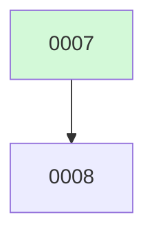

# Backlog

**8 changes** — 🟢 1 in progress · ✅ 7 done

## 🟢 In progress (1)

| # | Title | Priority | Type | Spec | Branch |
|---|-------|----------|------|------|--------|
| [0008](active/0008-mcp-integration-test-harness.md) | MCP Integration Test Harness (Docker Compose + Playwright) | `medium` | `chore` | [spec](../superpowers/specs/0008-mcp-integration-test-harness.md) | `` |

✅ Archive — done (7)

| # | Title | Merged |
|---|-------|--------|
| [0007](archive/2026-08-04-0007-mcp-http-oauth.md) | Remote MCP Servers via HTTP/SSE Transport + OAuth 2.0 | 2026-08-04 |
| [0006](archive/2026-08-04-0006-tui-markdown-rendering.md) | Terminal Markdown Rendering | 2026-08-04 |
| [0005](archive/2026-08-04-0005-tui-gutter-indent-fix.md) | Fix file-read gutter indentation in TUI | 2026-08-04 |
| [0004](archive/2026-08-04-0004-skill-runtime.md) | Skill Runtime | 2026-08-04 |
| [0003](archive/2026-08-04-0003-hitl-permissions-mcp.md) | HITL Permission Layer + MCP Client Integration | 2026-08-04 |
| [0002](archive/2026-08-04-0002-tui-mvp-makefile.md) | Bubbletea TUI MVP + Makefile | 2026-08-04 |
| [0001](archive/2026-08-04-0001-fuse.md) | Fuse — Multi-Model Agent Harness | 2026-08-04 |

