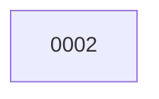

# Backlog

**2 changes** — 🔵 1 implemented · ✅ 1 done

## 🔵 Implemented — awaiting merge (1)

| # | Title | Priority | Type | PR | Readiness |
|---|-------|----------|------|----|-----------|
| [0002](active/0002-tui-mvp-makefile.md) | Bubbletea TUI MVP + Makefile | `high` | `feat` | [#2](https://github.com/ethanhinson/fuse/pull/2) |  |

✅ Archive — done (1)

| # | Title | Merged |
|---|-------|--------|
| [0001](archive/2026-08-04-0001-fuse.md) | Fuse — Multi-Model Agent Harness | 2026-08-04 |

