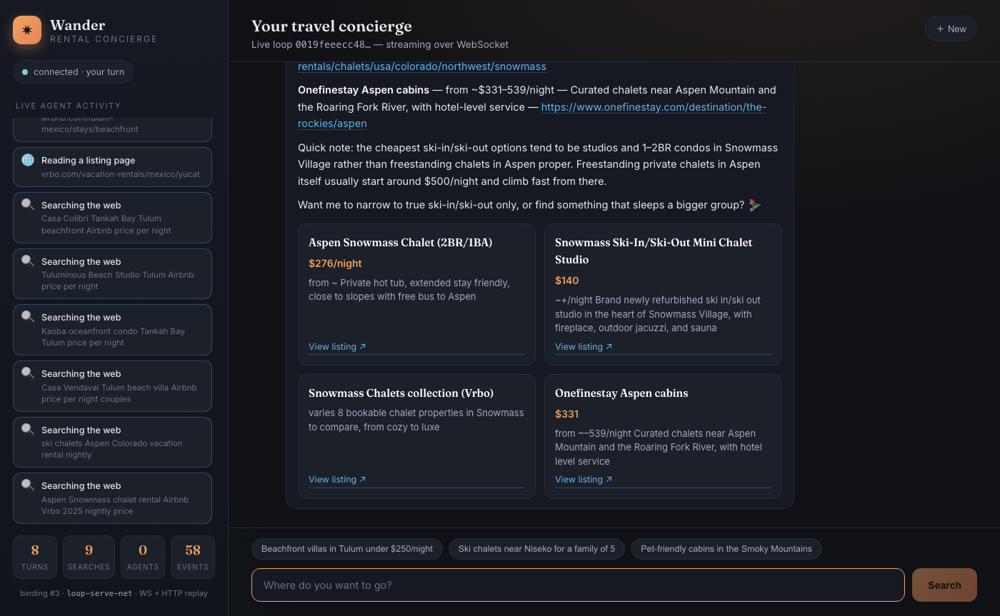

# Wander — a vacation-rental concierge over the networked runtime binding

A small HTML/CSS/JS chat app that demos **fuse binding #3** (change 0048,
_networked runtime binding_): the same policy-free `runtime.Runtime` that the CLI and
the stdio `loop-server` drive, now exposed **over WebSocket + HTTP** by the
`fuse loop-serve-net` subcommand.

The app is a travel concierge. You ask for a place to stay; the agent loop runs on the
server, uses the `web_search` tool (Tavily) to find **real, currently-listed** rentals,
reads listing pages, spawns research sub-agents, and streams every step back to the
browser — then renders a clean answer with rental cards and source links.



## What it demonstrates

The browser is just another **binding client** over the runtime seam. It speaks the
exact `loop.*` JSON-RPC protocol the WS transport serves — no new protocol, no SDK:

```
 → loop.start   { task, model, interactive } ⇒ { loop_id }
 → loop.observe { loop_id, from_seq }        ⇒ { replayed, last_seq }
 ← loop.event   { loop_id, event, gap }      (id-less server push — the live tail)
 → loop.send    { loop_id, input }           ⇒ {}   (follow-up turns, SAME loop)
```

### Multi-turn: one persistent loop

`loop.start` carries `"interactive": true`. On the server that opts the loop into
**persistent conversational mode** (a runtime change on this branch): instead of
finishing when the agent answers, the loop **parks** at the turn boundary awaiting the
next `loop.send`. So the *whole conversation* — "Tulum rentals" → "what about Aspen?"
→ "cheaper?" — runs on **one `loop_id`, one event stream, with server-authoritative
history** (the agent remembers earlier turns). Send a follow-up and the same loop
wakes and continues; it never returns `ErrLoopFinished` between turns.

Without the flag (e.g. binding #2's stdio clients) a loop stays single-task
run-to-completion — byte-identical to before.

### Link grounding

The model is prompted to cite only URLs that appeared in its real `web_search` /
`web_fetch` results, and the client **cross-checks** every rendered card link against
the URLs it actually saw stream by in `tool.result` events. A link the model invented
is shown as `⚠︎ unverified` rather than as a trustworthy listing link.

### The event stream

One WebSocket carries the **full session**. Each `loop.event` is an `event.Event`
(`{ seq, ts, turn, kind, payload }`) — `turn.start`, `model.call.start/end`,
`tool.call`, `tool.result`, `spawn.start/done`, `error`, … The client:

- maps each event kind to a line in the **live activity rail** (searches, page reads,
  scouts dispatched, context compaction);
- tracks `event.Seq` as its reconnect watermark and **dedups at the watermark**, so a
  reconnect that re-`observe`s from the last seq loses nothing and dupes nothing —
  exactly the subscribe-before-replay contract the server guarantees;
- treats the **terminal `model.call.end`** (assistant text with no following tool call)
  as the concierge's answer and renders it as the chat reply + rental cards.

The thin stateless **HTTP replay** endpoint (`GET /loops/{id}/events?from=<seq>`) is
proxied through too, for catch-up-only late joiners.

## Run it

```bash
cd examples/concierge-demo
./run.sh
# → open http://localhost:5173
```

`run.sh` starts two things and wires them together:

1. **`fuse loop-serve-net --addr 127.0.0.1:8787`** — binding #3 (WS `/ws` + HTTP
   `/loops/{id}/events`). Its policy is auto-approve (headless, no TTY), a *binding*
   choice, not a property of the seam.
2. **`node server.js`** (port 5173) — serves the static app and relays the browser's
   WebSocket + replay requests to the fuse binding, so the page needs no CORS and no
   knowledge of the backend address. Zero npm dependencies: it hand-rolls the small
   slice of RFC 6455 needed to pipe text frames.

### Environment

- `LLM_GATEWAY_URL` / `LLM_GATEWAY_KEY` — the model gateway (the demo uses the `glm`
  gateway model; per project policy, live demo traffic never routes to Claude).
- `TAVILY_API_KEY` — real web search. `run.sh` reads it from
  `~/dev/llm-research-agent/.env` if it isn't already exported.

Override with `FUSE_BIN`, `FUSE_NET_ADDR`, `PORT` if you want different wiring.

## Files

| File | What it is |
|------|-----------|
| `index.html` | chat + activity-rail shell |
| `styles.css` | the concierge look (no framework) |
| `app.js`     | the binding-#3 WebSocket client — the interesting part |
| `server.js`  | dependency-free static server + WS/HTTP proxy to fuse |
| `run.sh`     | one-command launcher for both processes |

> Note: `loop-serve-net` currently lives on the `feat/networked-runtime-binding`
> branch (change 0048, PR #51). `run.sh` builds from the branch worktree if present.
